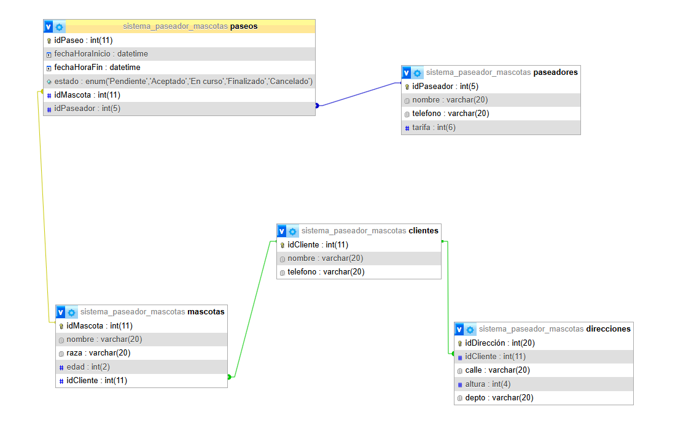

# TP: Sistema de Gestión de Paseadores de Mascotas

Este repositorio contiene el diseño, estructura de datos y consultas de base de datos para un sistema relacional de gestión de paseos de mascotas, desarrollado en el marco del trabajo práctico de la cursada.

## 🌟 1. Introducción y Planteo del Problema

En entornos urbanos, los dueños de mascotas carecen frecuentemente del tiempo necesario para pasear a sus perros, afectando su bienestar físico y emocional. Paralelamente, los paseadores independientes gestionan sus agendas, clientes, rutas y finanzas de forma manual o informal (mediante anotadores o chats de WhatsApp dispersos).

Este sistema resuelve tres problemáticas operativas críticas:

- **Trazabilidad de Servicios:** Monitoreo del estado real de cada paseo ('Pendiente', 'En curso', 'Finalizado', 'Cancelado').
- **Consistencia Logística:** Vinculación directa y ordenada de los clientes con sus múltiples direcciones de retiro y sus respectivas mascotas.
- **Control Financiero:** Automatización del cálculo de recaudación de cada paseador de acuerdo con sus tarifas específicas y los paseos completados.

---

## 🗺️ 2. Diagramas del Sistema

Se incluye un archivo .drawio que contiene dos versiones del diagrama (se puede acceder desde https://bit.ly/4wtfWO7), una lógica y otra física. A continuacion tambien se puede ver una captura de pantalla del modelo físico relacional generada desde phpMyAdmin:

### Modelo Físico Relacional (phpMyAdmin)



---

## 📖 3. Diccionario de Datos

### Tabla: `clientes`

_Resguardo de la información de contacto de los dueños de las mascotas._

| Campo         | Tipo de Dato  | Nulidad      | Atributos                   | Descripción                                 |
| :------------ | :------------ | :----------- | :-------------------------- | :------------------------------------------ |
| **idCliente** | `int(11)`     | NOT NULL     | Primary Key, Auto Increment | Identificador único del cliente.            |
| **nombre**    | `varchar(20)` | NOT NULL     | Default: 'NULL'             | Nombre y apellido del dueño.                |
| **telefono**  | `varchar(20)` | DEFAULT NULL |                             | Teléfono principal para urgencias o avisos. |

### Tabla: `direcciones`

_Domicilios de retiro asociados a los clientes (soporta n direcciones por cliente)._

| Campo           | Tipo de Dato  | Nulidad  | Atributos                   | Descripción                                           |
| :-------------- | :------------ | :------- | :-------------------------- | :---------------------------------------------------- |
| **idDirección** | `int(20)`     | NOT NULL | Primary Key, Auto Increment | Identificador único de la dirección.                  |
| **idCliente**   | `int(11)`     | NOT NULL | Foreign Key                 | Relación con el cliente dueño (`clientes.idCliente`). |
| **calle**       | `varchar(20)` | NOT NULL |                             | Nombre de la calle de residencia.                     |
| **altura**      | `int(4)`      | NOT NULL |                             | Altura catastral / número de puerta.                  |
| **depto**       | `varchar(20)` | NOT NULL |                             | Piso y departamento (o leyenda 'Casa').               |

### Tabla: `mascotas`

_Registro de los animales vinculados a cada cliente de la plataforma._

| Campo         | Tipo de Dato  | Nulidad  | Atributos                   | Descripción                                                  |
| :------------ | :------------ | :------- | :-------------------------- | :----------------------------------------------------------- |
| **idMascota** | `int(11)`     | NOT NULL | Primary Key, Auto Increment | Identificador único del animal.                              |
| **nombre**    | `varchar(20)` | NOT NULL | Default: '0'                | Nombre de la mascota.                                        |
| **raza**      | `varchar(20)` | NOT NULL | Default: '0'                | Raza o cruza del animal.                                     |
| **edad**      | `int(2)`      | NOT NULL |                             | Edad de la mascota en años cronológicos.                     |
| **idCliente** | `int(11)`     | NOT NULL | Foreign Key                 | Relación de pertenencia con el dueño (`clientes.idCliente`). |

### Tabla: `paseadores`

_Plantel de paseadores disponibles junto con sus cuadros tarifarios activos._

| Campo          | Tipo de Dato  | Nulidad  | Atributos                   | Descripción                                  |
| :------------- | :------------ | :------- | :-------------------------- | :------------------------------------------- |
| **idPaseador** | `int(5)`      | NOT NULL | Primary Key, Auto Increment | Identificador único del paseador.            |
| **nombre**     | `varchar(20)` | NOT NULL |                             | Nombre y apellido del prestador de servicio. |
| **telefono**   | `varchar(20)` | NOT NULL |                             | Teléfono de contacto del paseador.           |
| **tarifa**     | `int(6)`      | NOT NULL |                             | Costo unitario cobrado por paseo realizado.  |

### Tabla: `paseos`

_Entidad pivot central del negocio. Consolida la asignación logística y el estado de la operación._

| Campo               | Tipo de Dato | Nulidad      | Atributos                   | Descripción                                                              |
| :------------------ | :----------- | :----------- | :-------------------------- | :----------------------------------------------------------------------- |
| **idPaseo**         | `int(11)`    | NOT NULL     | Primary Key, Auto Increment | Identificador único de la orden de paseo.                                |
| **fechaHoraInicio** | `datetime`   | DEFAULT NULL |                             | Fecha y hora pautada de inicio del servicio.                             |
| **fechaHoraFin**    | `datetime`   | DEFAULT NULL |                             | Fecha y hora de finalización efectiva.                                   |
| **estado**          | `enum(...)`  | NOT NULL     | Default: 'Pendiente'        | Estados: 'Pendiente', 'Aceptado', 'En curso', 'Finalizado', 'Cancelado'. |
| **idMascota**       | `int(11)`    | NOT NULL     | Foreign Key                 | Mascota que asiste (`mascotas.idMascota`).                               |
| **idPaseador**      | `int(5)`     | NOT NULL     | Foreign Key                 | Paseador a cargo (`paseadores.idPaseador`).                              |

---

## 📊 4. Consultas y Reportes Estadísticos (SQL)

### Reporte 1: Hoja de Ruta Operativa General (Multijoin)

_Cruza las entidades principales para generar el listado activo de paseos, indicando mascota, dueño, dirección de retiro y el paseador responsable._

```sql
SELECT paseos.idPaseo, paseos.fechaHoraInicio, paseos.estado,
      mascotas.nombre AS nombre_mascota,
      clientes.nombre AS nombre_duenio,
      direcciones.calle, direcciones.altura,
      paseadores.nombre AS nombre_paseador
FROM paseos
JOIN mascotas ON paseos.idMascota = mascotas.idMascota
JOIN clientes ON mascotas.idCliente = clientes.idCliente
JOIN direcciones ON clientes.idCliente = direcciones.idCliente
JOIN paseadores ON paseos.idPaseador = paseadores.idPaseador;
```

### Reporte 2: Liquidación Financiera y Recaudación Efectiva

_Suma los ingresos generados por cada paseador contemplando exclusivamente servicios completados de manera exitosa._

```sql
SELECT paseadores.nombre AS nombre_paseador, SUM(paseadores.tarifa) AS total_recaudado
FROM paseadores
JOIN paseos ON paseadores.idPaseador = paseos.idPaseador
WHERE paseos.estado = 'Finalizado'
GROUP BY paseadores.idPaseador;
```

### Reporte 3: Clientes Multi-Mascota (Estrategia de Fidelización)

_Filtra y agrupa a aquellos clientes que tienen registrados más de un animal en el sistema, ideal para aplicar promociones._

```sql
SELECT clientes.nombre AS nombre_cliente, COUNT(DISTINCT mascotas.idMascota) AS total_mascotas
FROM clientes
JOIN mascotas ON clientes.idCliente = mascotas.idCliente
GROUP BY clientes.idCliente
HAVING total_mascotas > 1;
```

### Reporte 4: Balance Operativo de Estados de Paseos

_Muestra de forma cuantitativa cuántos paseos se encuentran en cada etapa del workflow diario._

```sql
SELECT paseos.estado, COUNT(paseos.idPaseo) AS total
FROM paseos
GROUP BY paseos.estado;
```

### Reporte 5: Segmentación Logística por Cachorros

_Agrupa a las mascotas de hasta 2 años de edad para armar contingentes de paseos de baja intensidad o adaptados._

```sql
SELECT mascotas.nombre AS mascota, mascotas.raza, mascotas.edad, clientes.nombre AS duenio
FROM mascotas
JOIN clientes ON mascotas.idCliente = clientes.idCliente
WHERE mascotas.edad <= 2;
```

---

## 🔌 5. Ejecución Local (Setup)

Para levantar el sistema en tu máquina con PHP y MySQL:

1. **Crear la base de datos:**

```sql
CREATE DATABASE sistema_paseador_mascotas;
```

2. **Importar el script:**

Importar el archivo `database\sistema_paseador_mascotas.sql` en tu gestor de base de datos.

---

## 📝 6. Conclusiones

Este sistema resuelve problemáticas operativas críticas:

- **Trazabilidad de Servicios:** Monitoreo del estado real de cada paseo ('Pendiente', 'En curso', 'Finalizado', 'Cancelado').
- **Consistencia Logística:** Vinculación directa y ordenada de los clientes con sus múltiples direcciones de retiro y sus respectivas mascotas.
- **Control Financiero:** Automatización del cálculo de recaudación de cada paseador de acuerdo con sus tarifas específicas y los paseos completados.

---

_Desarrollado por Basados._
